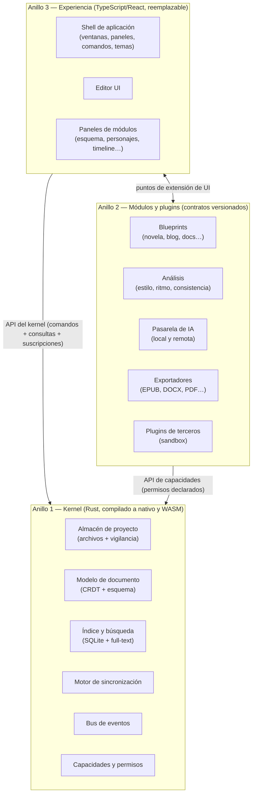
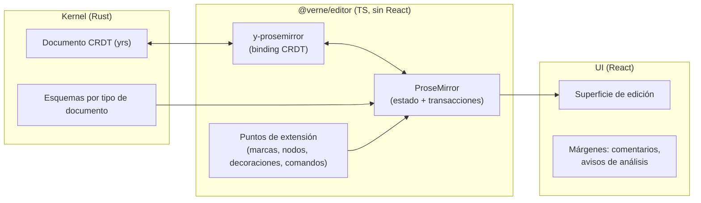
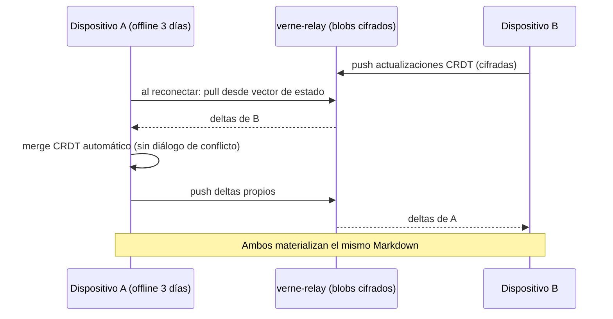
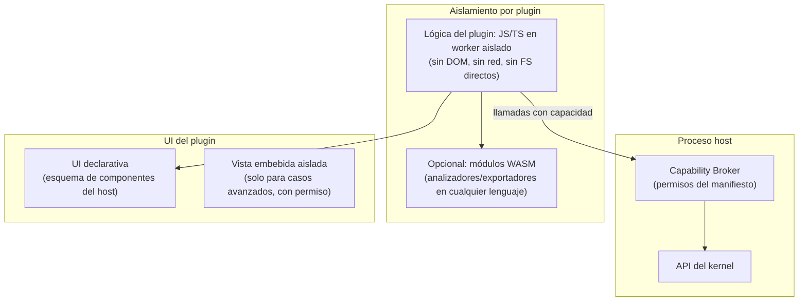
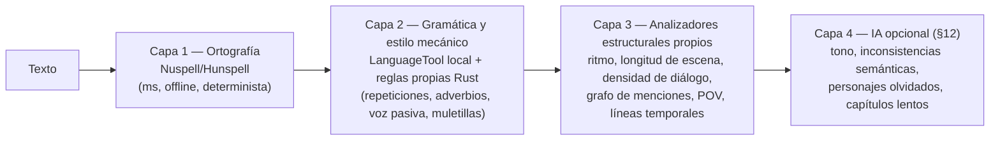
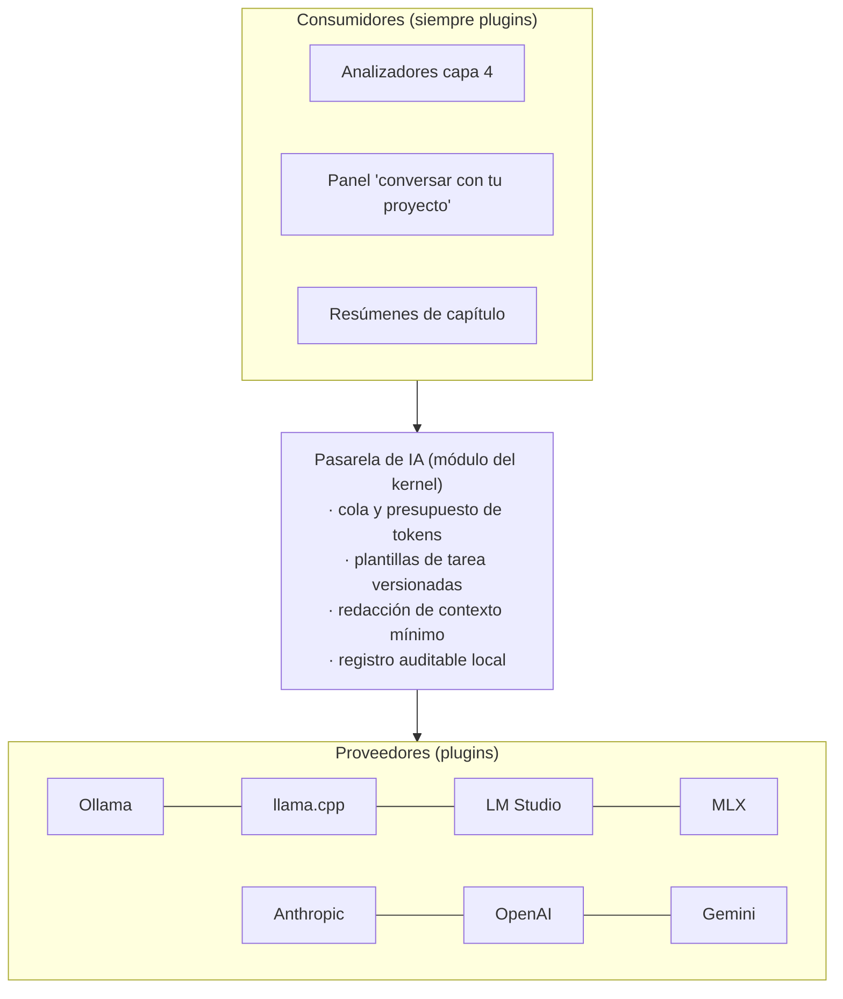

# RFC-0001 — Verne: Visión, Arquitectura y Roadmap

| Campo | Valor |
|---|---|
| Estado | Borrador para discusión |
| Tipo | RFC fundacional (visión + arquitectura) |
| Fecha | 2026-07-21 |
| Horizonte | 10 años |
| Ámbito | Todo el proyecto |
| Sustituye a | — |

> Este documento es la base oficial del proyecto. No contiene código: contiene decisiones,
> sus justificaciones, sus alternativas descartadas y sus riesgos. Toda decisión aquí tomada
> puede revertirse mediante un RFC posterior, nunca mediante un commit silencioso.

---

## 0. Resumen ejecutivo

**Verne** es una plataforma libre y de código abierto para escribir cualquier tipo de contenido:
novelas, blogs, documentación, guiones, newsletters, investigación, diarios y notas. No es un
editor de texto con extras; es un **sistema operativo para escritores** donde el editor es solo
uno de los módulos.

Las cinco decisiones estructurales de este RFC:

1. **Núcleo en Rust, interfaz en TypeScript/React.** Toda la lógica (almacenamiento, índice,
   búsqueda, análisis, exportación, sincronización) vive en un núcleo Rust compilable a nativo
   y a WASM. La UI es una capa delgada y reemplazable.
2. **Los archivos del usuario son Markdown en carpetas normales.** SQLite es solo un índice
   derivado y regenerable. El "Verne Project Format" es una especificación pública y versionada.
   Borrar Verne nunca borra tu obra ni la vuelve ilegible.
3. **Editor sobre ProseMirror**, con Markdown como formato de persistencia y un modelo de
   documento definido por esquema, preparado para colaboración CRDT desde el día uno.
4. **Sincronización mediante CRDT (Yjs/yrs)** con servidor de relevo minúsculo, autoalojable y
   opcional. Local-first no es un eslogan: la app entera funciona sin red para siempre.
5. **Todo lo que no es núcleo es un plugin**, incluidas las funciones propias (personajes,
   SEO, timeline, IA). Los "Blueprints" (novela, blog, documentación…) son manifiestos que
   activan módulos y adaptan la experiencia; también son plugins.

El roadmap se divide en 9 fases (0–8), desde investigación hasta la versión 1.0 estable, con
criterios de salida verificables por fase. La sección 19 critica las propias decisiones de este
documento, presenta tres arquitecturas alternativas completas y explica su descarte, y la
sección 19.5 corrige varias decisiones del planteamiento original del proyecto (alcance de
plataformas, orden del roadmap, licencia y la meta de "experiencia idéntica").

---

## 1. Visión del producto

### 1.1 El problema

Los escritores de hoy viven fragmentados entre herramientas:

- **Los procesadores de texto** (Word, Docs) tratan una novela igual que un memorándum.
- **Las apps de escritores** (Scrivener, Ulysses) son potentes pero cerradas, de pago, mono-plataforma
  en la práctica, y con formatos que envejecen mal.
- **Las apps de notas** (Obsidian, Notion, Bear, Craft) son excelentes para pensar, pero no entienden
  qué es un manuscrito, un arco de personaje o un calendario editorial.
- **Las herramientas de creadores** (CMS, SEO, guiones de vídeo) viven en el navegador, desconectadas
  del lugar donde realmente se escribe.

Nadie posee la categoría "el lugar donde un escritor hace todo su trabajo". Esa es la categoría
que Verne quiere poseer.

### 1.2 La tesis

> El valor no está en el editor. Está en que el sistema **entienda qué estás escribiendo**
> y adapte todo lo demás.

Un proyecto en Verne declara su tipo (novela, blog, guion, documentación…) y el sistema entero
se reconfigura: paneles, vocabulario, analizadores, exportadores, métricas y atajos. Quien
escribe un blog nunca ve fichas de personajes; quien escribe una novela nunca ve una puntuación
SEO. Un solo producto, muchas experiencias — sin que el usuario configure nada.

### 1.3 Identidad propia (qué somos y qué no)

| Somos | No somos |
|---|---|
| Un sistema operativo para escritores: proyectos, no archivos sueltos | Otro editor Markdown genérico |
| Local-first con archivos abiertos del usuario | Una app en la nube con "modo offline" |
| Un núcleo pequeño con ecosistema de plugins | Un monolito con 400 funciones integradas |
| Una herramienta que enseña a escribir mejor (explica, no solo corrige) | Un generador de texto con IA |
| Multiplataforma con paridad de datos garantizada | Multiplataforma con paridad de píxeles imposible |

**El nombre.** *Verne*, por Jules Verne: alguien que escribió novelas, divulgación, teatro y
geografía con el mismo método y una disciplina de sistema. Es corto, pronunciable en la mayoría
de idiomas y evoca "viaje largo planificado", que es exactamente lo que es escribir un libro.

### 1.4 Usuarios objetivo (en orden de prioridad)

1. **Escritores de ficción** (novela, cuento): la vertical más desatendida por el software abierto.
2. **Creadores de contenido escrito** (blog, newsletter): la vertical con más volumen de usuarios.
3. **Escritores técnicos** (documentación, libros técnicos): la vertical con más contribuidores
   potenciales al proyecto.
4. Guionistas, podcasters, videocreadores, diaristas: verticales servidas mediante Blueprints
   comunitarios, no por el equipo núcleo (ver §19.5).

Esta priorización importa: define qué Blueprints construye el equipo núcleo (tres) y cuáles
quedan para la comunidad (el resto).

### 1.5 Métrica norte

> **"Palabras escritas en sesiones de más de 25 minutos."**

No usuarios registrados, no notas creadas, no enlaces entre notas. Si Verne no logra que la
gente escriba de forma sostenida, todo lo demás es decoración. Toda decisión de UX se evalúa
contra esta métrica (con telemetría estrictamente opt-in, ver P12).

---

## 2. Filosofía del producto (principios normativos)

Estos 17 principios son **normativos**: un PR que los viole se rechaza, una función que los
viole no se construye, y cambiarlos requiere un RFC. Se citan como P1…P17.

| # | Principio | Consecuencia práctica no negociable |
|---|---|---|
| P1 | El usuario es dueño de sus datos | Archivos Markdown legibles en carpetas normales; especificación pública del formato; exportación completa en un clic; ningún dato solo-en-servidor |
| P2 | Local-first | Cero funciones del núcleo que requieran red; la sincronización es un módulo opcional y autoalojable |
| P3 | La IA es opcional y nunca escribe | Verne compila y funciona sin ningún proveedor de IA; la IA analiza y sugiere, jamás genera prosa del usuario; modelos locales primero |
| P4 | Modularidad | Módulos con contratos explícitos y versionados; ningún módulo importa internamente a otro |
| P5 | Extensibilidad | Todo lo que pueda ser plugin, es plugin — incluidas las funciones propias |
| P6 | Un proyecto, múltiples experiencias | Blueprints adaptan UI, herramientas y vocabulario por tipo de proyecto |
| P7 | Simplicidad primero | Cada función nueva paga su coste de complejidad; "no" es la respuesta por defecto |
| P8 | Rendimiento | Presupuestos medidos en CI: arranque, apertura de documentos de 1M palabras, latencia de tecleo, memoria (ver §16.1) |
| P9 | Multiplataforma | Paridad de **datos y modelo mental**, no de píxeles (ver corrección en §19.5.3) |
| P10 | Open source real | Núcleo 100% abierto; decisiones por RFC público; la documentación es parte del producto |
| P11 | Accesibilidad | Teclado completo, lectores de pantalla, temas claro/oscuro, escalado; criterio de aceptación en cada fase, no una fase aparte |
| P12 | Privacidad | Telemetría opt-in, agregada y documentada; sin cuentas obligatorias; sin venta de datos, jamás |
| P13 | Formatos abiertos | Markdown/JSON/YAML dentro; MD, HTML, DOCX, PDF, EPUB, TXT hacia fuera |
| P14 | El texto primero | La UI desaparece al escribir; modo enfoque es el estado natural, no una función |
| P15 | Arquitectura para 10 años | Optimizar para mantenimiento y reemplazabilidad de piezas, no para velocidad del MVP |
| P16 | Enseñar a escribir mejor | Cada corrección o análisis explica el porqué y enlaza al concepto; el usuario mejora, no solo el texto |
| P17 | Comunidad primero | RFCs públicos para decisiones grandes; gobernanza documentada; camino claro de contribuidor a maintainer |

**Cómo se resuelven los conflictos entre principios.** Los principios chocan entre sí (P5
extensibilidad vs P7 simplicidad; P8 rendimiento vs P9 multiplataforma). El orden de
precedencia cuando hay conflicto es: **P1 > P2 > P14 > P8 > el resto**. La propiedad de los
datos y el funcionamiento offline no se sacrifican por nada; después, la experiencia de
escritura; después, todo lo demás se negocia por RFC.

---

## 3. Análisis competitivo

Antes de diseñar, entender el terreno. Este análisis informa directamente decisiones
posteriores (se referencia desde §4, §7 y §9).

### 3.1 Scrivener

- **Fortalezas.** El mejor modelo mental de "proyecto largo" jamás diseñado: corcho, esquema,
  fichas, snapshots, compilación a múltiples formatos, metadatos por escena. Los novelistas lo
  aman porque entiende que un libro no es un archivo.
- **Debilidades.** Formato interno opaco (bundle RTF + XML frágil); sincronización históricamente
  dolorosa (Dropbox con corrupciones); UI densísima con años de acreción; curva de aprendizaje
  brutal; sin ecosistema de extensiones; desarrollo lento y cerrado.
- **Oportunidad para Verne.** Ofrecer el modelo mental de Scrivener (proyecto estructurado +
  compilación) sobre archivos abiertos, con sync fiable y una UI que revela complejidad
  progresivamente.
- **No copiar.** La "compilación" como pantalla de 40 opciones; los formatos internos opacos;
  la acumulación de preferencias (cientos de ajustes).

### 3.2 Obsidian

- **Fortalezas.** Archivos Markdown locales como religión; el ecosistema de plugins más exitoso
  de la categoría (miles); comunidad enorme; rendimiento sólido; el usuario confía porque puede
  irse cuando quiera. Es la prueba viviente de que P1+P5 generan amor y ecosistema.
- **Debilidades.** No es open source (solo la promesa del formato); los plugins corren sin
  sandbox con acceso total al vault y a Node (riesgo real de seguridad y de calidad); "vault de
  notas" no es "proyecto de escritura" (sin estructura de manuscrito, sin compilación seria);
  la UX de escritura larga es pobre; la personalización infinita convierte cada vault en un
  proyecto de bricolaje.
- **Oportunidad.** Ser "el Obsidian de los escritores": mismos valores de datos, pero con
  modelo de proyecto, plugins sandboxeados y núcleo realmente abierto.
- **No copiar.** Plugins sin sandbox (ver §9.2); dejar que la personalización sustituya al
  diseño de producto; el enlace bidireccional como centro del universo (para escribir libros
  es una herramienta, no la tesis).

### 3.3 Ulysses

- **Fortalezas.** La mejor experiencia de escritura pura del mercado: tipografía, foco, metas
  de escritura, biblioteca unificada, publicación directa a blogs. Markdown "sin fricción".
- **Debilidades.** Solo Apple; suscripción; biblioteca en base de datos propia (los archivos
  "externos" son ciudadanos de segunda); sin extensibilidad; sin herramientas de estructura
  para obra larga.
- **Oportunidad.** Llevar esa calidad de experiencia de escritura a todas las plataformas y
  hacerla abierta. Ulysses define el listón de P14.
- **No copiar.** El dialecto Markdown propio (Markdown XL) que rompe la portabilidad; la
  biblioteca-silo.

### 3.4 Ellipsus

- **Fortalezas.** Colaboración pensada para escritores (no para oficinas): borradores,
  comentarios, control de versiones comprensible para humanos; postura pública anti-IA
  generativa que le ha ganado una comunidad fiel de ficción.
- **Debilidades.** Web-céntrico y dependiente del servidor (lo contrario de P2); joven, con
  alcance funcional pequeño; sin extensibilidad; modelo de negocio incierto.
- **Oportunidad.** La colaboración por borradores ("drafts como conversación") es la mejor
  idea nueva de la categoría y encaja natural con CRDTs; adoptarla como patrón de diseño de
  nuestro módulo de colaboración.
- **No copiar.** La dependencia total del servidor; cuentas obligatorias para escribir.

### 3.5 Manuskript

- **Fortalezas.** Open source real (GPL, Python/Qt); pensado para novelistas (esquema, fichas,
  método copo de nieve); demuestra que existe demanda de un Scrivener libre.
- **Debilidades.** Desarrollo intermitente con pocos maintainers; UI anticuada; rendimiento
  pobre; sin sync, sin móvil, sin plugins. Es la advertencia de lo que pasa cuando un proyecto
  open source ambicioso no diseña para comunidad ni para mantenimiento (P15, P17).
- **Oportunidad / lección.** Su historia justifica nuestra inversión desproporcionada en
  gobernanza, documentación y arquitectura de contribución. El riesgo nº1 de Verne no es
  técnico: es convertirse en Manuskript (ver §16.5).

### 3.6 Notion

- **Fortalezas.** El modelo de bloques y las bases de datos como legos universales; colaboración
  impecable; plantillas como mecanismo de adopción viral.
- **Debilidades.** Cloud-cautivo (offline históricamente frágil); exportación con pérdida; lento
  con documentos largos; escribir prosa larga en Notion es incómodo (el bloque interrumpe el
  flujo); tu obra vive en los servidores de una empresa.
- **Oportunidad.** Las "bases de datos" de Notion, reinterpretadas local-first, son exactamente
  lo que necesitan personajes, localizaciones y calendarios editoriales: colecciones
  estructuradas definidas por esquema (ver §10.3).
- **No copiar.** El bloque como unidad de edición para prosa (rompe P14); la dependencia del
  servidor; el "todo es una página" que diluye el modelo de proyecto.

### 3.7 Craft

- **Fortalezas.** El mejor acabado visual de la categoría; demuestra que local-first y diseño
  premium son compatibles; excelente en móvil/tablet.
- **Debilidades.** Cerrado, freemium, Apple-céntrico de origen; extensibilidad mínima; más
  orientado a documentos bonitos que a obra larga.
- **Oportunidad.** El listón estético. El software libre no tiene por qué parecer software
  libre; Craft define el nivel de acabado al que Verne aspira.
- **No copiar.** Priorizar el efecto visual sobre la densidad de información útil para trabajo
  serio; funciones cautivas de un ecosistema (deep links propietarios).

### 3.8 Síntesis: el hueco en el mercado

| Capacidad | Scrivener | Obsidian | Ulysses | Notion | Ellipsus | **Verne (meta)** |
|---|---|---|---|---|---|---|
| Modelo de proyecto largo | ●● | ○ | ◐ | ◐ | ◐ | ●● |
| Datos abiertos y locales | ○ | ●● | ◐ | ○ | ○ | ●● |
| Experiencia de escritura | ◐ | ◐ | ●● | ○ | ● | ●● |
| Extensibilidad | ○ | ●● | ○ | ◐ | ○ | ●● (sandbox) |
| Colaboración | ○ | ○ | ○ | ●● | ●● | ● (CRDT, fase 4) |
| Multiplataforma | ◐ | ● | ○ | ● | ● | ● (progresivo) |
| Open source | ○ | ○ | ○ | ○ | ○ | ●● |
| Adaptación por tipo de proyecto | ○ | ○ | ○ | ◐ | ○ | ●● (Blueprints) |

Ninguna herramienta ocupa la columna completa. La combinación "modelo de proyecto de Scrivener
+ datos de Obsidian + escritura de Ulysses + colaboración de Ellipsus + colecciones de Notion,
todo abierto y adaptativo" no existe. Ese es Verne.

---
## 4. Arquitectura general

### 4.1 La decisión estructural: kernel + módulos + plugins

Verne se organiza en tres anillos, como un sistema operativo:



**Reglas de dependencia (se verifican en CI, no en revisiones de código):**

1. El kernel no conoce a ningún módulo ni a la UI. Solo expone contratos.
2. Los módulos no se importan entre sí; se comunican por el bus de eventos y por servicios
   registrados en el kernel.
3. La UI no contiene lógica de dominio: si un comportamiento debe sobrevivir a un cambio de
   framework de UI, vive en el kernel o en un módulo.
4. Los plugins de terceros usan exactamente la misma API que los módulos propios (P5). Si la
   API no basta para construir "Personajes", la API está incompleta — nosotros somos el primer
   cliente de nuestro propio sistema de plugins.

**Ventajas.** Reemplazabilidad (la UI puede migrar de framework sin tocar la lógica, P15);
paridad multiplataforma real (el mismo kernel corre en desktop nativo, web vía WASM y móvil,
P9); el sandbox de plugins cae naturalmente del modelo de capacidades; testear lógica sin UI.

**Desventajas asumidas.** Frontera FFI/serialización entre Rust y TS (coste de rendimiento y de
ergonomía); dos lenguajes elevan la barrera para contribuidores; el tipado debe generarse desde
un origen único (definiciones de contrato → tipos Rust + TS) para no divergir. Mitigaciones en
§5.7 y §16.

### 4.2 Comunicación: comandos, consultas y eventos

Tres mecanismos, cada uno con un propósito distinto — mezclarlos es la fuente clásica de
arquitecturas de aguas fecales:

| Mecanismo | Dirección | Naturaleza | Ejemplos |
|---|---|---|---|
| **Comandos** | UI/módulo → kernel | Imperativos, validados, con permisos; única vía de mutación | `document.applyEdit`, `project.create`, `export.run` |
| **Consultas** | UI/módulo → kernel | Lectura pura, cacheable, suscribible | `search.query`, `project.tree`, `stats.wordCount` |
| **Eventos** | kernel → todos | Hechos pasados, inmutables, fan-out | `document.changed`, `file.externallyModified`, `sync.conflictDetected` |

Reglas del bus de eventos:

- Los eventos son **hechos**, no órdenes: `document.saved`, jamás `please.reindex`. Quien
  reacciona decide qué hacer; el emisor no conoce a los receptores.
- Todo evento lleva esquema versionado. Un evento publicado es una API pública: se depreca con
  el mismo proceso que cualquier API (ver §9.6).
- Los manejadores de eventos no pueden bloquear el hilo del editor. El bus es asíncrono y los
  módulos lentos se degradan solos (backpressure con descarte de eventos coalescibles: diez
  `document.changed` seguidos colapsan en uno).

**Alternativa considerada y descartada:** un modelo de "todo es estado observable" (tipo Redux
global o base de datos reactiva única). Descartado porque acopla el rendimiento de toda la app
al peor módulo suscrito y hace imposible aislar plugins de terceros: un plugin no debe poder
observar estado para el que no tiene permiso, y un árbol de estado global convierte los permisos
en un colador.

### 4.3 Servicios del kernel

| Servicio | Responsabilidad | No responsabilidad |
|---|---|---|
| **Project Store** | Ciclo de vida del proyecto: layout de carpetas, manifiesto, vigilancia de cambios externos, transacciones de archivo | Interpretar contenido |
| **Document Engine** | Modelo CRDT del documento, esquema por tipo, historial, snapshots | Renderizar |
| **Index & Search** | Índice full-text e índice de metadatos en SQLite; siempre regenerable desde archivos | Ser fuente de verdad |
| **Sync Engine** | Replicación CRDT, detección de conflictos de archivos no-CRDT, estado de peers | Almacenar en servidor contenido en claro (E2E por defecto) |
| **Event Bus** | Pub/sub tipado con esquemas versionados | Lógica de negocio |
| **Capability Broker** | Permisos de módulos/plugins, mediación de acceso a archivos/red/IA | Política de UI |
| **Asset Store** | Binarios (imágenes, audio) con deduplicación y referencias | Edición de binarios |

Cada servicio tiene un documento de contrato en `docs/contracts/` y ese documento manda: si el
código y el contrato divergen, el código está mal.

---

## 5. Stack tecnológico y su justificación

Criterios de evaluación, por orden (derivados de P15, P8, P17): **(a)** ¿existirá y se mantendrá
en 10 años?, **(b)** ¿maximiza contribuidores potenciales?, **(c)** ¿cumple los presupuestos de
rendimiento?, **(d)** ¿nos deja rehenes de una empresa? La popularidad solo puntúa a través de
(b); no es un criterio en sí misma.

### 5.1 Lenguaje del núcleo: **Rust** (frente a Go y Node)

| Criterio | Rust | Go | Node/TS |
|---|---|---|---|
| Compila a WASM para web/móvil | Excelente, primera clase | Mediocre (runtime pesado, GC en WASM) | n/a (ya es JS) |
| Embebible en app de escritorio sin runtime | Sí | Sí, con GC | Requiere Node/V8 completo |
| Rendimiento y memoria predecibles (P8) | Sí, sin GC | GC con pausas pequeñas | GC + un solo hilo útil |
| Ecosistema relevante | tantivy (búsqueda), yrs (CRDT), rusqlite, Tauri | Bueno en servidores, débil en este dominio | Enorme pero frágil a 10 años |
| Barrera de entrada para contribuidores | **Alta** (su gran coste) | Baja | Muy baja |

**Decisión.** Rust. Es el único de los tres que puede ser *el mismo binario de lógica* en
Windows/macOS/Linux nativo, en el navegador vía WASM y dentro de apps móviles — condición
necesaria para P9 sin triplicar la lógica. Además el ecosistema exacto que necesitamos ya existe
en Rust: **yrs** (port oficial de Yjs), **tantivy** (motor full-text tipo Lucene), **rusqlite**,
y **Tauri**. Go habría sido más amable con contribuidores, pero su historia en WASM y en
bibliotecas embebidas es débil, y Node como núcleo nos ataría a Electron (ver §5.3).

**Coste asumido y mitigación.** Rust reduce el pool de contribuidores del núcleo. Mitigación
estructural: el 80% de la superficie de contribución (UI, módulos, Blueprints, plugins,
documentación, temas) es TypeScript o Markdown; Rust queda confinado al kernel, que es
deliberadamente pequeño y estable. Manuskript murió por falta de maintainers en un monolito;
nosotros concentramos la dificultad donde el cambio es infrecuente.

### 5.2 Framework de UI: **React** (frente a Vue y Svelte) — con cortafuegos

**Decisión.** React 19+, con una regla arquitectónica más importante que la elección misma:
**la UI no contiene lógica**. Todos los componentes consumen el kernel a través de un paquete
`@verne/client` agnóstico de framework. React es reemplazable por diseño; su elección es
táctica, no estructural.

**Por qué React y no Svelte (el segundo finalista).** Svelte 5 es técnicamente superior para
nuestro caso (menos JS enviado, reactividad fina ideal para paneles densos). Pero el criterio
(b) es decisivo en un proyecto comunitario: el pool de contribuidores React es un orden de
magnitud mayor, y las piezas de accesibilidad que P11 exige (Radix/react-aria para menús,
diálogos, árboles navegables por teclado) no tienen equivalente maduro en Svelte. Reconstruir
accesibilidad de primitivas es exactamente el tipo de trabajo invisible que un proyecto open
source nunca termina. Vue queda en medio en todo y no gana en nada para nosotros.

**Cortafuegos anti-obsolescencia (P15).** (1) Prohibido usar estado de React para estado de
dominio — el estado vive en el kernel y React solo se suscribe. (2) Los puntos de extensión de
UI para plugins son **agnósticos de framework** (ver §9.4): un plugin nunca importa React del
host, de modo que migrar de framework no rompe el ecosistema. (3) El editor (ProseMirror) y el
kernel no saben que React existe.

### 5.3 Escritorio: **Tauri** (frente a Electron)

| Criterio | Tauri 2 | Electron |
|---|---|---|
| Memoria base / tamaño de binario | ~½–⅓ de Electron / 10–20 MB | 150–250 MB instalado, >300 MB RAM base |
| Modelo de seguridad | Permisos declarativos, sin Node en el renderer | Historial de CVEs por `nodeIntegration`; requiere disciplina |
| Integración con núcleo Rust | Nativa (mismo proceso) | FFI vía N-API o proceso aparte |
| Consistencia de renderizado | **Riesgo**: WebView del SO (WebKitGTK en Linux es el débil) | Chromium idéntico en todas partes |
| Madurez / ecosistema | Joven pero estable desde 2.0 | Máxima madurez |

**Decisión.** Tauri 2. Tres razones dominan: (1) P8 — una app de escritura debe ser ligera; el
sobrecoste de Electron es exactamente la reputación que no queremos; (2) el kernel es Rust y
Tauri lo embebe en el mismo proceso, sin puente IPC pesado; (3) su modelo de permisos
declarativos alinea con nuestro Capability Broker.

**El riesgo real y su mitigación.** El WebView del sistema introduce inconsistencias
(especialmente WebKitGTK en Linux). Mitigación: presupuesto de CI con pruebas de renderizado en
los tres SO; polyfills centralizados en un solo paquete; y como **plan de escape documentado**,
la UI no usa ninguna API exclusiva de Tauri directamente (siempre a través de `@verne/client`),
de modo que un repliegue a Electron sería doloroso pero mecánico, no un rediseño. Reevaluación
formal del riesgo WebKitGTK al final de la fase 2 (criterio de salida en §15).

### 5.4 Móvil: decisión diferida con default declarado

Móvil llega tarde en el roadmap (fase 7+, ver corrección de alcance en §19.5). Decidir hoy el
framework móvil sería decidir con la peor información posible. Lo que sí se decide hoy es lo
que hace posible cualquier opción futura: **el kernel Rust compila a iOS/Android desde la fase
1** (CI lo verifica aunque no haya app).

- **Default declarado: Tauri 2 móvil** (mismo stack, misma UI adaptada, mismo kernel embebido).
- **Alternativa si Tauri móvil no madura: Capacitor** (reutiliza la app web completa; peor
  integración, pero mínimo coste incremental).
- **Descartados ya:** Flutter y React Native — ambos obligarían a reconstruir el editor (el
  activo más caro del proyecto) fuera de la plataforma web donde ProseMirror vive, rompiendo la
  paridad de comportamiento del documento. Un editor distinto por plataforma es el error que
  mató la calidad móvil de varias apps de la competencia.

### 5.5 Motor del editor: **ProseMirror** (frente a Lexical, TipTap y Slate)

| Criterio | ProseMirror | TipTap | Lexical | Slate |
|---|---|---|---|---|
| Madurez / historial de estabilidad | 2016, API estable, usado por NYT, Atlassian, GitLab | Wrapper de PM | 2022, API aún móvil | Historial de breaking changes |
| Modelo de documento por esquema | Núcleo del diseño | Heredado de PM | Parcial | Parcial |
| Colaboración CRDT | y-prosemirror, maduro y probado | Vía PM | Propio, menos probado | Débil |
| Gobernanza | Autor independiente + comunidad financiadora | **Empresa comercial (freemium)** | Meta | Comunidad pequeña |
| Independencia de framework UI | Total | Total | Acoplado a React en la práctica | Acoplado a React |

**Decisión.** ProseMirror directo, sin TipTap. TipTap acelera el arranque, pero (d) nos ataría
a una empresa cuyo negocio es vender extensiones (comentarios, historial, colaboración) que
nosotros necesitamos construir abiertas — un conflicto estructural a 10 años. Lexical viene de
Meta con historial de abandono de proyectos frontend y su modelo colaborativo es menos maduro
que y-prosemirror. Slate incumple (a). El coste de PM (API austera, curva dura) se paga una vez
y se encapsula en `@verne/editor`; el detalle del motor del editor está en §7.

### 5.6 Persistencia: **archivos + SQLite** (frente a IndexedDB y PouchDB)

**Decisión.** La fuente de verdad son **archivos del usuario** (Markdown + YAML + binarios);
**SQLite** (vía rusqlite en nativo; SQLite-WASM sobre OPFS en web) es un índice derivado,
siempre regenerable con `verne reindex`. IndexedDB se rechaza como almacén primario por su API
miserable, sus límites de eviction y su historial de corrupciones silenciosas; en web solo
actúa como caché de OPFS donde haga falta. PouchDB se rechaza porque su razón de ser es
replicar con CouchDB, y nuestra sincronización no es por documentos-revisión sino por CRDT
(§8): adoptar PouchDB sería adoptar el modelo de conflictos equivocado. Detalle completo del
modelo de almacenamiento en §6.

### 5.7 Sincronización: **Yjs/yrs** (frente a Automerge, ElectricSQL, Supabase y CouchDB)

**Decisión.** CRDTs con el ecosistema Yjs: **yrs** (Rust) en el kernel, **y-prosemirror** en el
editor. Es la única opción del mercado con (1) integración madura y probada con ProseMirror,
(2) implementación Rust oficial que encaja en nuestro kernel, y (3) años de producción en miles
de apps.

- **Automerge:** técnicamente admirable y con mejor historia teórica (patchwork de versiones),
  pero sin integración ProseMirror al nivel de y-prosemirror y con rendimiento históricamente
  inferior en documentos grandes. Se vigila (igual que **Loro**); la interfaz del Sync Engine
  no expone tipos Yjs crudos precisamente para poder migrar de CRDT si el ecosistema cambia.
- **ElectricSQL / Supabase:** modelos servidor-céntricos ("sync de base de datos Postgres").
  Violan P2 en espíritu: la autoridad queda en un Postgres. Supabase además incumple (d).
- **CouchDB/PouchDB:** replicación por revisiones con resolución de conflictos manual — el
  usuario final acabaría viendo "conflicted copies", que es exactamente la herida de Scrivener+
  Dropbox que venimos a curar.

El diseño completo de sincronización (incluida la relación CRDT ↔ archivos Markdown, que es el
problema difícil de verdad) está en §8.

### 5.8 Piezas restantes

| Necesidad | Elección | Justificación breve |
|---|---|---|
| Búsqueda full-text | **tantivy** (+ FTS5 de SQLite para consultas simples) | Lucene-class, Rust, embebible; FTS5 cubre web/WASM donde tantivy pese demasiado |
| Ortografía | **Nuspell/Hunspell** (bindings Rust) | Estándar de facto, diccionarios libres por idioma |
| Gramática | **LanguageTool** local opcional + reglas propias en Rust | P3: nada de IA para lo que resuelven reglas |
| Exportación DOCX/EPUB/PDF | Conversores propios sobre AST común; **Pandoc como plugin opcional**, nunca dependencia del núcleo | Pandoc es Haskell, ~100 MB: excelente herramienta, pésima dependencia embebida |
| Tipos compartidos Rust↔TS | Contratos definidos en esquema (source of truth) con generación de tipos a ambos lados | Evita la divergencia silenciosa entre kernel y UI |
| Monorepo | pnpm + Turborepo (TS) coexistiendo con Cargo workspace (Rust) | Estándares aburridos y probados; detalle en §14 |

---
## 6. Almacenamiento: el Verne Project Format (VPF)

### 6.1 Principios del formato

1. **Un proyecto es una carpeta.** Copiable, versionable con git, sincronizable con cualquier
   herramienta, legible sin Verne. (P1, P2)
2. **La prosa es Markdown plano** (CommonMark + un conjunto mínimo y documentado de
   extensiones: frontmatter YAML, notas al pie, comentarios). Nada de dialectos propios (la
   lección de Ulysses, §3.3).
3. **Los metadatos son YAML/JSON legibles**, nunca binarios opacos — con una excepción
   explícita y justificada: el estado CRDT (§6.3).
4. **El formato es una especificación pública versionada** (`docs/spec/vpf/`), con suite de
   conformidad. Otras herramientas pueden implementarlo; ese es el objetivo, no un riesgo.

### 6.2 Layout de un proyecto

```text
mi-novela/
├── verne.yaml                  # Manifiesto: tipo (blueprint), título, idioma, versión VPF
├── contenido/                  # La obra. Estructura libre del usuario
│   ├── 01-parte-uno/
│   │   ├── 01-el-faro.md       # Frontmatter YAML: estado, POV, sinopsis, etiquetas…
│   │   └── 02-la-tormenta.md
│   └── 02-parte-dos/…
├── colecciones/                # Datos estructurados del blueprint (ver §10.3)
│   ├── personajes/
│   │   ├── _schema.yaml        # Esquema de la colección (campos, tipos)
│   │   └── amelia-ruiz.md      # Ficha: frontmatter estructurado + prosa libre
│   └── localizaciones/…
├── recursos/                   # Imágenes, audio, adjuntos
├── export/                     # Perfiles de compilación/exportación (YAML)
└── .verne/                     # Estado interno: TODO regenerable o derivado
    ├── crdt/                   # Estado CRDT por documento (binario, ver §6.3)
    ├── index.db                # SQLite: índices, búsqueda, caches (regenerable)
    ├── history/                # Snapshots comprimidos para historial local
    └── sync.yaml               # Configuración de peers/servidor (opcional)
```

**La prueba de fuego del formato** (criterio de aceptación permanente en CI): borrar `.verne/`
entero no pierde ninguna palabra escrita ni ningún metadato editorial — solo historial fino y
cachés. Un proyecto VPF abierto en un editor de texto cualquiera es comprensible y editable.

### 6.3 La excepción binaria: estado CRDT

El estado CRDT (historial de operaciones que hace posible sync sin conflictos e historial de
escritura) es binario por naturaleza. Tratamiento honesto de la tensión con P13:

- El CRDT vive en `.verne/crdt/`, **fuera** del contenido del usuario.
- El Markdown se materializa en cada guardado: **el archivo `.md` siempre está al día**. El
  CRDT es la fuente de verdad *operacional* (para merge), el Markdown es la fuente de verdad
  *de contenido* (para el usuario). 
- Si un archivo `.md` cambia por fuera (git, otro editor) — detectado por vigilancia de
  archivos + hash — el kernel hace un *rebase* del cambio externo sobre el CRDT (diff textual →
  operaciones). El usuario nunca es castigado por editar sus propios archivos con otra
  herramienta. Este flujo es de los más complejos del kernel y tiene su propia suite de tortura
  (fase 4).

### 6.4 SQLite como índice derivado

`index.db` contiene: índice full-text, grafo de referencias internas (menciones de personajes,
enlaces), métricas (recuentos, sesiones de escritura), y colas de trabajo de analizadores.
Reglas: se puede borrar siempre; ninguna escritura de usuario transita por él; los módulos leen
por la API de consultas, jamás SQL directo (el esquema interno no es API pública).

**Ventaja adicional no obvia:** al ser derivado, las migraciones de esquema de índice son
triviales (regenerar), lo que elimina la clase entera de bugs de migración de datos de usuario
que arrastran las apps con BD-como-verdad.

---

## 7. Motor del editor

### 7.1 Arquitectura



- **El esquema manda.** Cada tipo de documento (prosa, guion, nota, ficha) tiene un esquema
  ProseMirror propio, aportado por el Blueprint. Un guion tiene nodos `escena`, `diálogo`,
  `acotación`; una novela tiene `escena` y `separador`; una nota es casi Markdown puro. Esto es
  lo que hace real a P6 en el editor: no es "el mismo editor con botones ocultos", es un editor
  cuyo modelo de documento es distinto por tipo.
- **El binding CRDT es permanente, no un "modo colaboración".** El documento *es* el CRDT
  desde la fase 2, aunque la sync llegue en la fase 4. Retroadaptar CRDT a un editor existente
  es el error histórico de la categoría (años de dolor en apps que lo intentaron); nosotros lo
  evitamos pagando el coste al principio.
- **Rendimiento con manuscritos enormes (P8).** Un documento = una escena/sección, no un libro
  entero; el "modo manuscrito" (leer/editar el libro completo en continuo, estilo Scrivener)
  se implementa con virtualización de secciones: solo las escenas visibles montan instancias
  de editor; el resto es texto renderizado estáticamente. Presupuesto: abrir un proyecto de
  1M de palabras < 2 s; latencia de tecleo p99 < 16 ms (medido en CI sobre hardware modesto).

### 7.2 Qué es el editor y qué no

| Es responsabilidad del editor | No lo es (y quién la tiene) |
|---|---|
| Fidelidad del modelo de documento | Guardar archivos (kernel) |
| Edición, selección, atajos, IME, dictado del SO | Ortografía/gramática (módulo de análisis, vía decoraciones) |
| Decoraciones (subrayados, resaltados, fantasmas de comentario) | Decidir qué decorar (módulos) |
| Modo enfoque, máquina de escribir, foco por frase/párrafo (P14) | Estadísticas y metas (módulo de métricas) |
| Vistas: escritura, esquema inline, comparación de versiones | Corcho/kanban/timeline (paneles de módulos) |

Los plugins **no tocan ProseMirror directamente**: consumen los puntos de extensión declarativos
de `@verne/editor` (registrar una marca, un tipo de nodo, una decoración, un comando). Exponer
ProseMirror crudo congelaría para siempre nuestra libertad de sustituir el motor (P15) y daría
a cualquier plugin el poder de corromper documentos.

---

## 8. Sincronización y colaboración

### 8.1 Modelo

- **Unidad de sincronización:** el proyecto. **Unidad de merge:** el documento CRDT.
- **Transporte:** WebSocket contra un servidor de relevo minúsculo (**verne-relay**, Rust,
  autoalojable con un binario y un volumen), o sync por carpeta (Dropbox/Syncthing/iCloud)
  como modo degradado soportado oficialmente — los CRDT hacen seguro lo que en Scrivener era
  ruleta rusa.
- **Cifrado de extremo a extremo por defecto** en verne-relay: el servidor almacena blobs
  cifrados y no puede leer manuscritos. Consecuencia asumida y documentada: funciones
  server-side (p. ej. render de vistas web compartidas) requieren relajación explícita por
  proyecto.
- **Offline indefinido:** semanas sin conexión convergen sin intervención. Los binarios
  (recursos) no van por CRDT: content-addressing + last-writer-wins con papelera local.



### 8.2 Colaboración humana (la capa sobre la técnica)

El merge automático resuelve el problema técnico, no el social: dos escritores no quieren
mezclar prosa "carácter a carácter" sin enterarse. Adoptamos el patrón de **Ellipsus** (§3.4):

- **Borradores como ramas legibles:** un colaborador trabaja en un borrador con nombre; la
  fusión a la línea principal es un acto editorial explícito con vista de comparación, no un
  efecto de red.
- **Comentarios y sugerencias** como anotaciones ancladas al CRDT (sobreviven a ediciones).
- La co-edición en vivo (cursores compartidos) existe porque el CRDT la regala, pero es un
  modo que se activa, no el default: escribir no es un Google Doc de oficina.

### 8.3 Identidad y cuentas

Sin cuenta global obligatoria (P2, P12). Identidad por par de claves generado en el
dispositivo; compartir un proyecto = intercambiar invitación (URL/QR con clave). Un directorio
de cuentas opcional podrá existir para descubrimiento, gestionado como servicio comunitario,
nunca como requisito.

---
## 9. Sistema de plugins

### 9.1 Objetivo y postura

El núcleo permanece pequeño porque todo lo demás es plugin — incluidos los módulos propios
(P5). Terceros pueden crear: exportadores, analizadores, temas, proveedores de IA, paneles,
herramientas, integraciones de publicación y Blueprints completos.

### 9.2 La decisión difícil: sandbox obligatorio

Obsidian demuestra que los plugins sin sandbox generan el ecosistema más grande… y también que
cada plugin instalado puede leer, exfiltrar o destruir todo el vault, y que la calidad media
degrada la estabilidad del host. Para una herramienta cuyo contenido son manuscritos inéditos
—a veces bajo contrato editorial— ese modelo es inaceptable. **Decisión: sandbox con
capacidades declaradas, sin excepciones.** Asumimos el coste: nuestro ecosistema crecerá más
lento que uno "todo permitido". Es el precio de P1 y P12, y lo pagamos con una API tan amplia
que el sandbox no se sienta como una jaula (regla del §4.1: nuestros propios módulos viven
dentro de ella).

### 9.3 Arquitectura del sandbox



- **Lógica en JS/TS dentro de un worker aislado** (sin DOM ni Node), comunicado por mensajes
  tipados. Es el modelo Figma, el único que ha producido un gran ecosistema *seguro*.
- **WASM como segundo runtime** para plugins de cómputo (un exportador escrito en Rust o Go,
  un analizador lingüístico): mismo broker de capacidades, portabilidad total.
- **Manifiesto de capacidades:** cada plugin declara qué necesita (`leer:contenido`,
  `escribir:colecciones/personajes`, `red:api.midominio.com`, `ia:solicitar`). El instalador
  lo muestra en lenguaje humano; el broker lo impone en runtime. Sin capacidad, la llamada no
  existe.
- **UI en dos niveles:** (1) **declarativa** — el plugin describe paneles, listas, formularios,
  comandos y ajustes con el esquema de componentes del host, que los renderiza nativos al tema
  y accesibles gratis (P11); cubre el 90% de los casos. (2) **vista embebida aislada** para
  visualizaciones ricas (un mapa de mundo interactivo), con coste de permiso explícito. En
  ningún caso el plugin importa el framework del host (cortafuegos de §5.2).

### 9.4 Puntos de extensión (superficie inicial)

| Punto | Ejemplos de plugin |
|---|---|
| Comandos y paleta | "Enviar a mi CMS", "Generar índice onomástico" |
| Paneles laterales/inferiores | Metrónomo de escritura, tablero kanban |
| Decoraciones del editor | Resaltado de adverbios, densidad de diálogo |
| Analizadores (pipeline §11) | Legibilidad en alemán, clichés por género literario |
| Exportadores (AST → formato) | LaTeX, Fountain, MDX, formatos de imprenta |
| Proveedores de IA (§12) | Backend para un runtime local nuevo |
| Colecciones y esquemas | "Sistema de magia", "Calendario ficticio" |
| Blueprints completos | "Tesis doctoral", "D&D campaign" |
| Temas | Tipografía y color, tokens documentados |

### 9.5 Distribución

Registro de plugins en un repositorio git público (modelo Obsidian/Homebrew: PR = envío) con
revisión automatizada (lint de manifiesto, escaneo de capacidades sospechosas) + revisión
humana ligera para el listado destacado. Instalación desde archivo siempre posible (sin
gatekeeping real, P10). Firmado de paquetes desde la fase 5 para poder revocar plugins
maliciosos publicados.

### 9.6 Estabilidad de API

- La API de plugins es semver-estricta; se congela en 1.0 (fase 8) y antes se marca
  explícitamente como inestable.
- Política de deprecación: nada se elimina sin ciclo de dos versiones menores con avisos.
- Suite de compatibilidad pública: un plugin que pasa la suite N sigue funcionando en N+1, y
  romper eso es un bug del host, no del plugin. Esta promesa es el activo que hace crecer un
  ecosistema; Obsidian la cumple informalmente, nosotros la formalizamos.

---

## 10. Blueprints: un proyecto, múltiples experiencias

### 10.1 Qué es un Blueprint

Un Blueprint es un manifiesto (YAML + esquemas + textos) que configura la experiencia completa
para un tipo de proyecto: qué módulos se activan, qué esquemas de documento usa el editor, qué
colecciones existen, qué paneles se muestran, qué analizadores corren, qué exportadores se
ofrecen y qué **vocabulario** usa la UI ("capítulo" vs "entrada" vs "escena" vs "episodio").

**Un Blueprint es un plugin** (empaquetado y distribuido igual), pero de un tipo especial que
solo puede activarse al nivel de proyecto. El equipo núcleo mantiene tres (novela, blog/
newsletter, documentación); el resto (guion, podcast, vídeo, diario, investigación, libro
técnico, cuento) nace en `blueprints/` como semillas comunitarias (§19.5.1).

### 10.2 Ejemplo de contraste

| Aspecto | Blueprint **Novela** | Blueprint **Blog/Newsletter** |
|---|---|---|
| Estructura | Manuscrito → partes → capítulos → escenas | Flujo: ideas → borradores → publicados |
| Colecciones | Personajes, localizaciones, tramas | Categorías, series, destinos de publicación |
| Paneles | Corcho, timeline, matriz POV | Calendario editorial, estado por canal |
| Analizadores | Consistencia de personajes, ritmo, POV | Legibilidad, SEO, longitud por canal |
| Exportadores | EPUB, DOCX (formato manuscrito), PDF | HTML/MDX, RSS, integraciones CMS |
| Métricas | Palabras/sesión, avance sobre meta del libro | Cadencia de publicación |
| Vocabulario | "Capítulo", "escena", "manuscrito" | "Entrada", "borrador", "publicar" |

El novelista jamás ve SEO; el blogger jamás ve fichas de personaje (P6). No hay modo "todo
activado": la ausencia de un selector de funciones es una decisión de producto, no una carencia.

### 10.3 Colecciones: la mejor idea de Notion, hecha local-first

Una **colección** es un conjunto de fichas con esquema (`_schema.yaml`: campos tipados +
prosa libre), almacenadas como Markdown con frontmatter (§6.2). El kernel las indexa y ofrece
consultas (filtrar, ordenar, agrupar, contar); los paneles las muestran como tabla, galería,
tablero o línea temporal. Personajes, localizaciones, calendario editorial, fuentes de
investigación: todo es la misma primitiva. Los Blueprints definen colecciones; los plugins
pueden añadir otras. Así evitamos construir N módulos verticales: construimos una primitiva y
N esquemas.

---

## 11. Sistema de análisis

### 11.1 El pipeline (P3: cada problema en su capa más barata)



Reglas: una capa superior nunca hace el trabajo de una inferior (la IA no corrige tildes);
las capas 1–3 funcionan siempre y offline; la capa 4 puede no existir y nada se degrada.

### 11.2 Diseño técnico

- Los analizadores son **plugins** (propios o de terceros) que se registran en el pipeline con
  un contrato: reciben texto/AST + contexto de proyecto permitido por capacidades, emiten
  **diagnósticos** tipados (rango, severidad, categoría, explicación, arreglos sugeridos).
- Corren en segundo plano con prioridades (capa 1 casi en tiempo real; capa 3 en pausas de
  escritura; capa 4 solo bajo demanda explícita) y jamás bloquean el tecleo (P8). Incremental:
  reanalizar solo lo que cambió, con invalidación por dependencias (cambiar el nombre de un
  personaje invalida el grafo de menciones, no la legibilidad).
- Los diagnósticos estructurales (capa 3) usan el índice del kernel: el grafo de menciones de
  personajes se computa una vez y lo consumen N analizadores.

### 11.3 P16: los diagnósticos enseñan

Cada diagnóstico incluye un "porqué" en lenguaje claro y un enlace a una entrada de la **guía
de escritura** integrada (contenido abierto, en `docs/writing-guide/`, traducible por la
comunidad). El panel de análisis tiene modo "explícame" (aprender) y modo "solo marca"
(revisar rápido). Nunca hay "aplicar todos los arreglos": cada aceptación es una decisión del
escritor. Antipatrón explícito: convertir el panel en un semáforo de gamificación tipo
"puntuación de escritura 87/100" — prohibido; los números sin explicación no enseñan (P16) y
empujan a escribir para la métrica.

---

## 12. Sistema de IA

### 12.1 Postura (P3, innegociable)

- La IA **nunca genera prosa del usuario**. No hay "continuar escribiendo", no hay "redacta
  este capítulo". Hay análisis, preguntas socráticas y señalamientos: "Elena tenía los ojos
  verdes en el cap. 2 y grises en el 14", "estas tres escenas seguidas tienen el mismo ritmo",
  "resumen del capítulo para tu escaleta".
- Verne sin IA es Verne completo. El módulo puede desinstalarse.
- **Local primero:** Ollama, llama.cpp (servidor HTTP), LM Studio y MLX como backends de
  primera clase. Remotos (Anthropic, OpenAI, Gemini) opcionales, con clave del usuario.

### 12.2 Arquitectura: la pasarela de IA



Por qué una pasarela y no llamadas directas: (1) **privacidad** — un solo punto que decide qué
contexto sale del dispositivo, lo minimiza y lo registra en un log auditable por el usuario
("qué se envió, a quién, cuándo"); (2) **consentimiento por proyecto** — los proveedores
remotos requieren opt-in explícito por proyecto, y un proyecto puede marcarse "solo local"
(un manuscrito bajo NDA jamás toca la red ni por error de un plugin); (3) **portabilidad** —
los consumidores declaran *tareas* ("resume", "compara", "detecta inconsistencias"), no
prompts contra un proveedor concreto: cambiar de modelo no rompe funciones; (4) **presupuesto**
— coste y latencia visibles y limitables.

### 12.3 Contexto: RAG sobre el índice propio

Los análisis de obra larga (¿olvidé a este personaje?) no caben en una ventana de contexto. La
pasarela usa el índice del kernel (búsqueda + grafo de menciones + resúmenes por capítulo
generados y cacheados incrementalmente) para armar contexto mínimo por tarea. Los resúmenes en
caché se invalidan por edición — el mismo mecanismo incremental del pipeline de análisis
(§11.2). Sin dependencia de un vector-store externo: FTS + heurísticas primero; embeddings
locales como mejora opcional cuando midamos que aportan.

---

## 13. Exportación y compilación

- **Arquitectura:** documento(s) → **AST común de exportación** (estable, versionado) →
  exportadores (plugins) → MD, HTML, DOCX, EPUB, PDF, TXT. Los exportadores no leen archivos:
  reciben el AST y los perfiles.
- **Perfiles de compilación** (en `export/`, YAML versionable): qué documentos entran, en qué
  orden, con qué transformaciones (separadores de escena, supresión de comentarios, portada,
  estilos). Es el "Compile" de Scrivener sin su pantalla-cabina-de-avión: cada Blueprint trae
  2–3 perfiles que funcionan sin configurar nada, y el ajuste fino es progresivo (P7).
- **PDF:** render propio vía motor de composición embebible (evaluación en fase 6 entre
  Typst embebido y render HTML→PDF del WebView; criterio: calidad tipográfica de imprenta sin
  dependencia de 100 MB). LaTeX y Pandoc: plugins comunitarios, nunca núcleo (§5.8).

---
## 14. Organización del monorepo

Un solo repositorio (`verne`) con dos espacios de trabajo coexistentes (Cargo para Rust, pnpm +
Turborepo para TS). Un monorepo porque los contratos kernel↔UI↔plugins cambian juntos al
principio; separar repos antes de la 1.0 multiplicaría PRs sincronizados.

```text
verne/
├── crates/                     # Rust (Cargo workspace)
│   ├── verne-kernel/           # Orquestación de servicios del kernel
│   ├── verne-store/            # VPF: proyecto, archivos, vigilancia
│   ├── verne-doc/              # Modelo de documento (yrs), esquemas
│   ├── verne-index/            # SQLite, tantivy, consultas
│   ├── verne-sync/             # Motor CRDT de sincronización
│   ├── verne-analyze/          # Pipeline y analizadores capas 1–3
│   ├── verne-export/           # AST de exportación y conversores base
│   ├── verne-ai/               # Pasarela de IA
│   ├── verne-plugin-host/      # Sandbox: workers, WASM, broker de capacidades
│   └── verne-relay/            # Servidor de sincronización autoalojable
├── packages/                   # TypeScript (pnpm workspace)
│   ├── contracts/              # ★ Origen único de contratos → genera tipos Rust y TS
│   ├── client/                 # SDK agnóstico de framework sobre el kernel
│   ├── editor/                 # ProseMirror + y-prosemirror + puntos de extensión
│   ├── ui/                     # Sistema de diseño (tokens, componentes accesibles)
│   ├── plugin-sdk/             # SDK público para autores de plugins
│   └── shell/                  # Aplicación: paneles, comandos, ajustes
├── apps/
│   ├── desktop/                # Tauri (Win/macOS/Linux)
│   ├── web/                    # PWA (kernel en WASM + OPFS)
│   └── mobile/                 # (fase 7+; placeholder con decisión en §5.4)
├── blueprints/                 # novela/, blog/, docs/ (núcleo) + semillas comunitarias
├── plugins/                    # Plugins propios de referencia (dogfooding del SDK)
├── docs/                       # Docusaurus o similar: manual, guía de escritura
│   ├── spec/vpf/               # ★ Especificación pública del formato
│   ├── contracts/              # Contratos de servicios del kernel
│   └── writing-guide/          # Contenido educativo de P16
├── rfcs/                       # Proceso de decisión (este documento es el 0001)
├── examples/                   # Proyectos VPF de ejemplo por blueprint
├── tools/                      # Generación de tipos, benchmarks, suite de conformidad VPF
└── .github/                    # CI: presupuestos de rendimiento, matriz 3 SO, WASM, móvil
```

Decisiones de soporte: `contracts/` es el corazón anti-divergencia (los tipos Rust y TS se
generan, nunca se escriben dos veces); `plugins/` propios existen para garantizar que el SDK
público basta (regla §4.1.4); `examples/` alimenta tests de integración y documentación a la
vez. Versionado: lockstep de todo el monorepo antes de 1.0; a partir de 1.0, `plugin-sdk`,
`contracts` y la spec VPF llevan semver independiente porque son promesas públicas.

---

## 15. Roadmap

Cada fase tiene objetivos, riesgos, dependencias y **criterios de salida verificables** (la
fase no termina por fecha, termina por criterio — y las fases se solapan solo en preparación,
nunca en criterios). Nota: respecto al roadmap del planteamiento original se adelanta el
sistema de plugins y se retrasa la sincronización multi-dispositivo; la justificación de este
cambio está en §19.5.2.

### Fase 0 — Investigación y fundación (≈ 2 meses)
- **Objetivos:** validar supuestos con 20–30 entrevistas a escritores de las 3 verticales;
  prototipos desechables de los 2 riesgos técnicos top (CRDT↔Markdown round-trip; rendimiento
  de WebView con documentos de 1M palabras en los 3 SO); redactar spec VPF v0; establecer
  gobernanza (licencias §19.5.4, código de conducta, proceso RFC).
- **Riesgos:** enamorarse de los prototipos ("ya casi funciona, sigamos con esto").
  Mitigación: los prototipos se archivan por contrato; nada de su código pasa a `main`.
- **Dependencias:** ninguna.
- **Salida:** RFC-0001 (este documento) ratificado tras discusión pública; spec VPF v0
  publicada; informes de los dos prototipos con números; decisión Tauri confirmada o revocada
  con datos.

### Fase 1 — Arquitectura y esqueleto (≈ 3 meses)
- **Objetivos:** monorepo completo con CI (3 SO + WASM + targets móviles compilando);
  `contracts/` con generación de tipos funcionando; kernel esqueleto (Project Store + Event
  Bus + índice mínimo); shell Tauri que abre un proyecto VPF y muestra su árbol; presupuestos
  de rendimiento automatizados en CI desde el primer día.
- **Riesgos:** sobre-arquitectura sin usuario (astronautas de la abstracción). Mitigación:
  cada contrato debe tener un consumidor real en la misma fase o no se escribe.
- **Dependencias:** fase 0 (spec VPF, decisión de stack).
- **Salida:** un contribuidor externo puede clonar, compilar y ejecutar en los 3 SO siguiendo
  la documentación en <30 min (probado con personas reales); ADRs escritos para cada elección
  de §5.

### Fase 2 — Editor (≈ 4 meses)
- **Objetivos:** `@verne/editor` con esquema de prosa, binding CRDT permanente, Markdown
  round-trip sin pérdida (suite de tortura), modo enfoque (P14), virtualización para modo
  manuscrito, accesibilidad del editor (navegación, lectores de pantalla), autosave y
  historial local de snapshots.
- **Riesgos:** el round-trip Markdown↔ProseMirror↔CRDT es el pozo técnico más profundo del
  proyecto; riesgo de latencia en WebViews no-Chromium.
- **Dependencias:** fase 1.
- **Salida:** presupuestos P8 en verde en CI (apertura 1M palabras <2 s, p99 tecleo <16 ms en
  hardware de referencia modesto); 0 pérdidas en la suite de round-trip; el equipo escribe sus
  documentos del proyecto en Verne a diario (dogfooding obligatorio); **checkpoint del riesgo
  WebKitGTK (§5.3): decisión go/no-go sobre Tauri con datos, punto de reversión más barato**.

### Fase 3 — Organización y proyecto (≈ 3 meses)
- **Objetivos:** modelo de proyecto completo (árbol, mover/dividir/fusionar documentos,
  metadatos, papelera); colecciones (§10.3) con primer esquema (personajes); búsqueda global;
  Blueprint Novela v0 y Blueprint Blog v0 hardcodeados aún como módulos internos; métricas de
  escritura y metas; exportación básica (MD, HTML, DOCX simple).
- **Riesgos:** deriva de alcance en los Blueprints ("una función más de Scrivener…").
  Mitigación: corpus de casos de las entrevistas de fase 0 como frontera; lo que no esté ahí,
  espera.
- **Dependencias:** fase 2.
- **Salida:** una beta privada usable: 20 escritores reales completan un proyecto corto
  (relato / 5 entradas de blog) sin tocar la terminal ni perder datos; NPS cualitativo
  recogido; primera versión de la guía de escritura (P16) publicada.

### Fase 4 — Plugins y Blueprints (≈ 4 meses) *(adelantada; justificación en §19.5.2)*
- **Objetivos:** plugin host (workers + broker de capacidades); UI declarativa; migrar los
  módulos internos de fase 3 (personajes, exportadores, métricas) a plugins reales sobre el
  SDK público — la prueba de fuego del §4.1.4; Blueprints como paquetes; registro de plugins
  v0; documentación del SDK con 3 tutoriales.
- **Riesgos:** API insuficiente (los plugins de terceros no pueden hacer nada útil) o API
  filtrada (exponer ProseMirror/SQLite y quedar congelados). Mitigación: los tres primeros
  plugins comunitarios se desarrollan en pairing con sus autores antes de congelar nada.
- **Dependencias:** fase 3.
- **Salida:** los módulos propios corren como plugins sin privilegios especiales; ≥3 plugins
  escritos por personas ajenas al equipo funcionan; un Blueprint comunitario (p. ej. guion)
  creado fuera del equipo núcleo.

### Fase 5 — Sincronización y colaboración (≈ 4 meses)
- **Objetivos:** verne-relay (E2E por defecto); sync multi-dispositivo; rebase de ediciones
  externas (§6.3) endurecido; modo carpeta-sincronizada soportado; borradores y comentarios
  (§8.2); web app (WASM+OPFS) en beta como segundo cliente real del kernel.
- **Riesgos:** el mayor riesgo de pérdida de datos de todo el proyecto vive aquí. Mitigación:
  fuzzing de convergencia (miles de historias de edición aleatorias multi-peer en CI);
  historial local como red de seguridad siempre activa; beta cerrada larga.
- **Dependencias:** fases 2 (CRDT ya nativo) y 4 (la web app consume el mismo SDK).
- **Salida:** 3 dispositivos + web convergen tras semanas offline en la suite de fuzzing con
  0 divergencias; auditoría externa del diseño E2E; guía de autoalojamiento probada por
  terceros.

### Fase 6 — Analizadores y exportación completa (≈ 3 meses)
- **Objetivos:** pipeline de análisis capas 1–3 (§11); diagnósticos con "porqué" y guía
  (P16); exportación EPUB y PDF de calidad de imprenta; perfiles de compilación; integraciones
  de publicación (blog) como plugins.
- **Riesgos:** ruido de diagnósticos (la app que te regaña no se usa). Mitigación: defaults
  conservadores por Blueprint; medición de tasa de aceptación/silenciado por regla.
- **Dependencias:** fase 4 (los analizadores son plugins).
- **Salida:** un manuscrito real exportado a EPUB pasa validación epubcheck y una imprenta
  acepta el PDF; capas 1–2 en 6+ idiomas.

### Fase 7 — IA local y móvil beta (≈ 4 meses)
- **Objetivos:** pasarela de IA (§12) con Ollama/llama.cpp/LM Studio/MLX y remotos BYOK;
  analizadores capa 4 (consistencia semántica, resúmenes, ritmo); log de auditoría y
  consentimiento por proyecto; beta móvil (lectura + edición ligera + captura) según decisión
  §5.4.
- **Riesgos:** sobrepromesa de la IA local en hardware modesto; scope creep móvil.
  Mitigación: las funciones de IA declaran requisitos de modelo y se degradan con honestidad;
  móvil beta es *companion*, no paridad (§19.5.3).
- **Dependencias:** fases 5 y 6.
- **Salida:** las 5 tareas de IA definidas funcionan end-to-end con un modelo local de gama
  media; 0 bytes salen del dispositivo sin opt-in verificado por tests; móvil beta en
  TestFlight/Play con sync fiable.

### Fase 8 — Estabilización y 1.0 (≈ 3 meses)
- **Objetivos:** congelación de API de plugins, spec VPF 1.0, promesa de compatibilidad
  (§9.6); auditoría de accesibilidad completa (P11); auditoría de seguridad del sandbox y del
  E2E; rendimiento final; documentación completa en ≥2 idiomas; gobernanza post-1.0
  (maintainers, presupuesto, proceso de releases).
- **Riesgos:** lanzar por agotamiento antes de los criterios; la avalancha de issues post-1.0
  sin estructura de triage. Mitigación: criterios firmados por los maintainers; equipo de
  triage reclutado en fases 5–7.
- **Salida (definición de 1.0):** cero bugs conocidos de pérdida de datos; presupuestos P8 en
  verde; WCAG 2.1 AA en flujos principales; ≥15 plugins y ≥5 Blueprints comunitarios; ≥3
  maintainers activos que no fundaron el proyecto (el criterio anti-Manuskript).

---

## 16. Riesgos y mitigaciones

### 16.1 Técnicos

| Riesgo | Prob. | Impacto | Mitigación |
|---|---|---|---|
| Round-trip CRDT↔Markdown con pérdida o divergencia | Alta | Crítico (confianza) | Prototipo en fase 0; suite de tortura; fuzzing de convergencia; historial local siempre activo |
| WebKitGTK (Linux) degrada el editor | Media | Alto | Presupuestos por SO en CI; checkpoint go/no-go en fase 2; plan de escape a Electron documentado (§5.3) |
| Rendimiento WASM+OPFS insuficiente en web | Media | Medio | Web es cliente secundario hasta fase 5; degradar funciones (sin tantivy → FTS5), no datos |
| Frontera Rust↔TS se vuelve un pantano de serialización | Media | Alto | `contracts/` como origen único; presupuesto de latencia de IPC en CI; API por lotes, no chatty |
| Sandbox de plugins con fugas (seguridad) | Media | Crítico | Superficie mínima por capacidades; auditoría externa en fase 8; firmado y revocación (§9.5) |

### 16.2 De producto/UX

| Riesgo | Mitigación |
|---|---|
| "Sistema operativo para escritores" = app intimidante | Los Blueprints ocultan todo lo no pertinente; onboarding = elegir tipo y escribir; revelación progresiva como criterio de revisión de diseño |
| Blueprints demasiado rígidos ("soy blogger pero quiero personajes") | Los Blueprints activan módulos, no los prohíben: cualquier módulo puede añadirse manualmente a un proyecto; el default es la opinión, no la jaula |
| El pipeline de análisis se siente como un profesor pesado | Silenciable por regla/documento/proyecto; defaults mínimos; medir tasa de silenciado como métrica de calidad |
| Parálisis por personalización (síndrome Obsidian) | Temas y ajustes limitados a propósito en el núcleo (P7); la personalización profunda vive en plugins, elegida, no presentada |

### 16.3 De escalabilidad

Proyectos gigantes (10M palabras): la unidad documento-por-escena + virtualización + índices
incrementales están diseñados para esto; benchmark de proyecto sintético gigante en CI.
Ecosistema grande (miles de plugins): registro con revisión automatizada y reputación;
namespace por autor. Sync a escala: verne-relay es stateless respecto al contenido (blobs
E2E), escala horizontal trivial; el coste computacional del merge vive en los clientes.

### 16.4 De comunidad open source (el riesgo nº 1)

| Riesgo | Mitigación |
|---|---|
| Abandono del maintainer fundador (el destino Manuskript) | Criterio 1.0: ≥3 maintainers no-fundadores; bus factor medido por área en `GOVERNANCE.md`; todo conocimiento en docs, no en cabezas |
| Rust como barrera de contribución | 80% de superficie contribuble en TS/Markdown (§5.1); etiquetas "good first issue" por lenguaje; arquitectura que confina la dificultad |
| Burnout por soporte | Triage rotativo; plantillas de issue duras; foro comunitario separado del bug tracker |
| Fork hostil o captura comercial | Licencias pensadas para ello (§19.5.4); marca registrada del nombre en manos de una asociación/fundación, no de una persona |
| Financiación | Open Collective/GitHub Sponsors desde fase 1 con transparencia total; servicios opcionales (relay gestionado) como vía futura sin cautividad — el relay oficial jamás tendrá funciones que el autoalojado no tenga |

---

## 17. Futuras funcionalidades (explícitamente fuera del alcance 1.0)

En orden de probabilidad, todas condicionadas a RFC propio: modo revisión editorial profesional
(control de cambios interoperable con DOCX de editoriales); estadísticas longitudinales de
hábito de escritura; publicación directa multi-plataforma ampliada (más CMS, redes, KDP);
grabación/notas de voz con transcripción local para los Blueprints de podcast/vídeo; tiendas de
Blueprints con contenido educativo de escritores profesionales; federación de relays
(descubrimiento entre servidores autoalojados); modo lectura beta pública con comentarios de
lectores; embeddings locales para búsqueda semántica (§12.3).

Anti-roadmap (cosas que Verne no hará, para poder decir que no una sola vez): generación de
prosa por IA (P3); marketplace de pago con revenue share (convierte el proyecto en plataforma
comercial y a los plugins en SaaS); jardín cerrado de sync (P1); gamificación de la escritura
con rachas y puntuaciones (P16); editor de maquetación completo tipo InDesign (categoría
distinta).

---
## 18. Gobernanza y proceso RFC

- **Proceso RFC** (este documento es el RFC-0001): toda decisión que afecte a formato de
  datos, API pública, principios P1–P17, stack estructural o gobernanza requiere RFC en
  `rfcs/`, con plantilla (contexto, propuesta, alternativas, impacto en principios, plan de
  migración), periodo de comentarios público ≥14 días y decisión razonada por escrito. Lo que
  no toca esas áreas se decide en PR normal — el proceso pesado es para lo que es caro
  revertir, no para todo (P7 aplicado a la gobernanza).
- **Roles:** contribuidor → committer (por área) → maintainer (con camino documentado en
  `GOVERNANCE.md`). Decisiones por consenso aproximado; los maintainers desempatan; los
  principios P1–P17 solo cambian por supermayoría.
- **Transparencia:** roadmap público; reuniones de decisión con notas publicadas; finanzas
  abiertas (Open Collective).
- **El nombre y la marca** pertenecen a la entidad comunitaria (asociación o fiscal host), no
  a un individuo — condición para sobrevivir a cualquier fundador (§16.4).

---

## 19. Autocrítica, alternativas y correcciones

### 19.1 Crítica de mis propias decisiones

1. **Rust + TS es la decisión más cara del documento.** Dos lenguajes, una frontera FFI, tipos
   generados: es fricción diaria durante años. La sostengo por P9+P8+P15 (§5.1), pero si el
   equipo inicial son 1–2 personas sin Rust sólido, esta arquitectura puede matarlos antes que
   salvarlos. Umbral honesto: sin al menos una persona con Rust de producción comprometida
   ≥1 año, ejecutar la Alternativa A (§19.2) y migrar el kernel después.
2. **CRDT permanente desde la fase 2** encarece el editor antes de que exista un solo usuario
   que sincronice. Lo defiendo porque retroadaptarlo es peor (evidencia histórica de la
   categoría), pero es una apuesta de ~2 meses extra de fase 2 que retrasa el primer contacto
   con usuarios.
3. **El sandbox estricto puede estrangular el ecosistema.** Obsidian ganó su ecosistema con
   permisividad. Si en la fase 4 los autores de plugins chocan una y otra vez con la jaula, la
   respuesta correcta será ampliar la API deprisa — y si aún así no basta, un RFC tendrá que
   reabrir esta decisión con datos. Está permitido cambiar de opinión; no está permitido
   hacerlo en silencio.
4. **Tres Blueprints núcleo pueden ser demasiados.** El instinto dice novela+blog; añadí
   documentación por la vertical de contribuidores (§1.4). Si en fase 3 los recursos aprietan,
   documentación es el primero que cae a "semilla comunitaria".
5. **ProseMirror sin TipTap** significa construir a mano tablas, listas de tareas y otros
   nodos que TipTap regala. Son semanas de trabajo conocidas y aburridas. El razonamiento de
   independencia (§5.5) me sigue pareciendo correcto a 10 años, pero que nadie descubra ese
   coste en la fase 2: está comprado aquí, por adelantado.

### 19.2 Tres arquitecturas alternativas completas (y por qué se descartan)

**Alternativa A — "El camino Obsidian": Electron + TypeScript en todo.**
Un solo lenguaje; kernel TS como paquete Node; SQLite vía better-sqlite3; sync Yjs (JS);
plugins sin sandbox o con sandbox laxo; Chromium idéntico en todas partes.
*Ventajas:* velocidad de desarrollo máxima; pool de contribuidores máximo; cero frontera FFI;
el editor y el kernel comparten runtime. *Por qué se descarta:* móvil y web quedan sin camino
compartido (Node no corre allí; habría que reescribir el kernel o encadenarse a webviews con
otro runtime); la reputación de consumo de Electron contradice P8 y el posicionamiento; y el
sandbox laxo es incompatible con manuscritos bajo contrato (§9.2). Es la mejor alternativa si
el equipo es pequeño y sin Rust (ver 19.1.1) — por eso queda documentada como plan B real, no
como espantapájaros.

**Alternativa B — "Todo nativo Rust": kernel + UI nativa (Slint/GPUI/egui o Flutter-sobre-Rust).**
Sin webview: render propio, un solo lenguaje, rendimiento máximo, binarios diminutos.
*Ventajas:* la mejor latencia y memoria posibles; independencia total de la plataforma web.
*Por qué se descarta:* el estado del arte en edición de texto rico (IME, RTL, accesibilidad de
lectores de pantalla, corrección del SO, emoji, dictado) vive en los motores web; recrearlo es
un proyecto de una década en sí mismo — exactamente donde no queremos gastar nuestra década.
P11 sola ya lo descarta: la accesibilidad de toolkits nativos jóvenes es inmadura. Además el
ecosistema de plugins en UI nativa obligaría a un lenguaje de scripting embebido, empequeñeciendo
el pool de autores.

**Alternativa C — "El camino Ellipsus/Notion": web-first con servidor autoritativo.**
App web + Postgres + colaboración server-side; clientes de escritorio como envoltorios; offline
como caché.
*Ventajas:* colaboración y compartición triviales; despliegue continuo; un solo target de
render; onboarding sin instalación. *Por qué se descarta:* viola frontalmente P1 y P2 — la
autoridad de los datos vive en un servidor, el offline es un modo degradado, y el proyecto
open source degenera en "software que solo su empresa puede operar". Para un producto cuyo
contrato moral es "tu obra es tuya y funciona sin nosotros", esta arquitectura es la antítesis;
la cito porque es la que elegiría casi cualquier startup del sector, y conviene dejar escrito
por qué nosotros no.

### 19.3 Problemas probables a cinco años (2031)

1. **Deriva de la frontera Rust↔TS:** presión constante por "solo esta vez" meter lógica en la
   UI. Antídoto: el lint de dependencias en CI (§4.1) y revisiones que lo traten como deuda, no
   como estilo.
2. **Obsolescencia del binding CRDT:** el ecosistema CRDT se mueve rápido (Loro, Automerge 3…);
   y-prosemirror podría quedar atrás. Antídoto ya tomado: el Sync Engine no expone tipos Yjs
   (§5.7); migrar sería costoso pero local.
3. **Museo de plugins muertos:** miles de plugins abandonados que rompen la confianza del
   usuario nuevo. Antídoto: señales de mantenimiento en el registro (última actualización,
   compatibilidad declarada, adopción) y archivado automático.
4. **Presión comercial sobre la IA:** proveedores regalando integración "gratis" a cambio de
   telemetría o defaults. Antídoto: P3+P12 son innegociables por RFC de supermayoría; la
   pasarela (§12.2) es el único punto de entrada y audita todo.
5. **Éxito asimétrico:** que Verne triunfe como "app de blog" y la vertical de novela (más
   cara de mantener) languidezca — o viceversa. Antídoto: métricas por Blueprint publicadas y
   decisión consciente anual de inversión, no deriva.
6. **Cambio de plataforma imprevisible** (p. ej. WebKitGTK abandonado, App Store hostil al
   sideloading de plugins): el plan de escape §5.3 y el sandbox propio (que no depende de
   permisos del SO) son los amortiguadores.

### 19.4 Si Verne superara 1.000.000 de usuarios

La arquitectura local-first **no cambia** — esa es precisamente su virtud: un millón de
usuarios offline cuestan cero servidores. Lo que cambia:

- **Sync:** verne-relay pasa de binario único a flota stateless tras un balanceador (posible
  porque el relay nunca interpreta contenido, solo mueve blobs E2E); sharding por proyecto;
  presencia (awareness) separada del almacenamiento. El merge sigue en los clientes: el coste
  computacional escala con los usuarios, no con nuestros servidores.
- **Registro de plugins y actualizaciones:** CDN + firmas + mirrors comunitarios (modelo
  F-Droid/Homebrew), para que ni la distribución dependa de un único operador.
- **Organización:** fundación con empleados para seguridad, infraestructura y triage; el
  cuello de botella a esa escala es humano (revisión de plugins, CVEs, soporte), no técnico.
- **Lo que NO haríamos:** migrar a la Alternativa C "porque ya somos grandes". La historia de
  la categoría (Evernote, Notion offline) enseña que el servidor-céntrico a escala es más caro
  y más frágil que el local-first a escala. Si hoy empezara sabiendo que habrá un millón de
  usuarios, elegiría exactamente esta arquitectura — con más inversión inicial en el fuzzing
  de sync y en el equipo de seguridad del sandbox, que son los dos puntos donde la escala
  multiplica el daño de un error.

### 19.5 Correcciones al planteamiento original (donde discrepo del encargo)

1. **"12 tipos de contenido" no puede ser el alcance del equipo núcleo.** Podcasts y vídeos
   sugieren audio/vídeo tooling — categoría distinta con física distinta. Corrección: el
   núcleo entrega la *plataforma* (colecciones, Blueprints, plugins) y **tres** Blueprints
   excelentes; podcast/vídeo/guion/diario son Blueprints (sus guiones y notas de episodio son
   texto, y eso Verne lo hace muy bien), sembrados para la comunidad. Doce experiencias
   mediocres matarían el proyecto; tres excelentes + una plataforma lo hacen inevitable.
2. **El orden del roadmap original (sync fase 4, plugins fase 5) está invertido.** Los
   plugins son la arquitectura (los módulos propios deben ser plugins, §4.1.4): retrasarlos
   garantiza construir módulos acoplados que luego habría que migrar. La sync, en cambio,
   necesita que existan editor+CRDT estables y una web app que la ejercite. Corrección
   aplicada en §15: plugins fase 4, sync fase 5 — con el CRDT nativo desde la fase 2, que es
   lo que de verdad protege el futuro de la sincronización.
3. **"Experiencia prácticamente idéntica en 6 plataformas" es la meta equivocada.** Perseguir
   paridad de píxeles produce apps mediocres en todas partes (y móvil no debe ser un
   escritorio pequeño: es captura, lectura y revisión). Corrección: paridad de **datos,
   formato y modelo mental** garantizada por el kernel único; experiencia *apropiada* por
   plataforma. Escribir el capítulo en el escritorio; releerlo y anotar en el móvil; todo
   converge.
4. **La licencia AGPL-3.0 única (hoy en el repositorio) es un error para este diseño.** AGPL
   es excelente para `verne-relay` (impide SaaS cautivo del servidor de sync), pero aplicada
   al SDK de plugins, a `contracts/` y a la spec VPF **envenena el ecosistema**: autores de
   plugins y otras apps que quieran leer VPF quedarían atrapados por el copyleft, exactamente
   lo contrario de P1 ("otras herramientas pueden implementar el formato es el objetivo",
   §6.1). Corrección propuesta, a ratificar como RFC-0002: **Apache-2.0/MIT para SDK,
   contratos, spec y bibliotecas de formato; GPL-3.0 (o AGPL) para las apps; AGPL-3.0 para el
   relay**. Decidirlo antes de la primera contribución externa: cambiar licencias después
   requiere el consentimiento de cada contribuidor.
5. **"La IA enseña a escribir" necesita un guardarraíl más:** P16 se cumple con las capas 1–3
   y la guía de escritura *sin* IA; la capa 4 lo enriquece. Si la pedagogía dependiera de la
   IA, P3 ("Verne sin IA es Verne completo") sería falso. El documento ya lo refleja (§11.3),
   pero lo hago explícito porque es el desvío más tentador.

---

## 20. Recomendaciones para comenzar el desarrollo

1. **Semana 1:** publicar este RFC para discusión; abrir `rfcs/`, `GOVERNANCE.md` borrador y
   el código de conducta; **resolver la licencia (§19.5.4) antes del primer PR externo**.
2. **Primer trimestre = fase 0 estricta:** las 20–30 entrevistas y los 2 prototipos
   desechables (CRDT↔Markdown; rendimiento WebView 3 SO). Resistir la tentación de "empezar
   la app": los dos prototipos deciden si Tauri y el diseño §6.3 sobreviven, y son las dos
   reversiones más caras del proyecto si se descubren tarde.
3. **Contratar/reclutar contra el riesgo, no contra el entusiasmo:** la primera incorporación
   ideal sabe Rust y sistemas de archivos/CRDT; la segunda, ProseMirror y accesibilidad; la
   tercera es technical writer (la documentación es producto, P10).
4. **CI antes que features:** presupuestos de rendimiento, matriz de 3 SO, compilación WASM y
   móvil, y la prueba "borrar `.verne/` no pierde nada" — todo en verde desde la fase 1 con
   la app casi vacía. Es barato instalarlo cuando no hay nada y carísimo después.
5. **Dogfooding institucional:** desde la fase 2, toda la documentación del proyecto se
   escribe en Verne (Blueprint documentación). Ningún bug duele más que el que te impide
   escribir tu propio changelog.
6. **Comunidad antes del lanzamiento:** devlog público quincenal desde la fase 0 (el modelo
   que hizo crecer a Obsidian y a tantos indies); los primeros 100 usuarios se reclutan de las
   entrevistas de la fase 0.
7. **Disciplina de alcance:** imprimir §17 ("anti-roadmap") y §19.5.1 (tres Blueprints) y
   tratarlos como contrato. Cada "¿y si además…?" se responde con "¿es un plugin? entonces
   después de la fase 4; ¿no puede serlo? entonces RFC".

---

## Apéndice A — Glosario

| Término | Definición |
|---|---|
| **VPF** | Verne Project Format: especificación abierta del proyecto-como-carpeta (§6) |
| **Kernel** | Núcleo Rust: almacenamiento, documento, índice, sync, eventos, capacidades (§4.3) |
| **Blueprint** | Paquete que define la experiencia de un tipo de proyecto (§10) |
| **Colección** | Conjunto de fichas Markdown con esquema tipado (§10.3) |
| **Capacidad** | Permiso declarado y mediado que autoriza a un plugin a usar una API (§9.3) |
| **Pasarela de IA** | Único punto de acceso a modelos, local o remoto, con auditoría (§12.2) |
| **Perfil de compilación** | Receta declarativa de exportación de un conjunto de documentos (§13) |
| **verne-relay** | Servidor de sincronización autoalojable, ciego al contenido (E2E) (§8.1) |

## Apéndice B — Índice de decisiones (ADR-index)

| # | Decisión | Sección | Reversibilidad |
|---|---|---|---|
| D1 | Kernel Rust / UI TypeScript | §5.1 | Muy cara — validar en fase 0/1 |
| D2 | React con cortafuegos anti-lock-in | §5.2 | Barata por diseño |
| D3 | Tauri sobre Electron | §5.3 | Media — plan de escape documentado; checkpoint fase 2 |
| D4 | ProseMirror directo, sin TipTap | §5.5 | Cara tras fase 2 |
| D5 | Archivos como verdad + SQLite derivado | §5.6, §6 | Fundacional — solo por RFC |
| D6 | CRDT Yjs/yrs, permanente desde fase 2 | §5.7, §7.1 | Cara — interfaz aislada para migrar de CRDT |
| D7 | Sandbox de plugins por capacidades | §9 | Media — reabrible con datos (§19.1.3) |
| D8 | Blueprints como plugins; 3 en el núcleo | §10, §19.5.1 | Barata |
| D9 | IA solo-análisis tras pasarela auditada | §12 | Fundacional (P3) — supermayoría |
| D10 | Licencias por capa (Apache/MIT + GPL + AGPL) | §19.5.4 | Solo antes de contribuciones externas |

---

*Fin del RFC-0001. Se abre el periodo de comentarios: toda discusión, en el issue tracker
público enlazando a la sección discutida. Las próximas revisiones de este documento listarán
aquí su changelog.*
